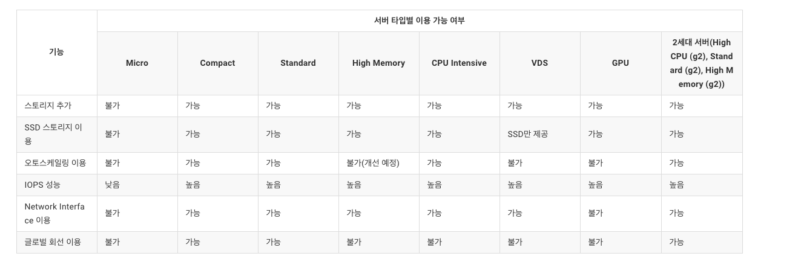

# 서버 생성
## 1세대 vs 2세대

2세대 서버 CPU, Network >>> 1세대 서버 (네이버 클라우드 플랫폼 콘솔상에서 선택 가능)
2세대 서버는 각 스펙 별로 **상품코드** 제공, API 및 CLI 사용시 유용
2세대에 CentOS7.8, Ubuntu18.04 tkdydrksmd
1세대 서버의 Compact, Standard 타입간에 스펙 변경 기능 제공 X

서버 생성절차
콘솔접속 - 서버 이미지 선택 - 서버 설정 - 인증키 설정 - 방화벽 설정 - 확인

1. 콘솔 접속 : 콘솔 접속
2. 서버 이미지 선택 : CentOs, Windows, Ubuntu
3. 서버 설정 : 스토리지, 서버타입, 요금제, Zone 선택
4. 인증키 설정 : 인증키 발급
5. 방화벽 설정 : NCP 에서 제공, 반드시 하나의 ACG 선택 (최대 5개)
6. 최종 확인 : 서버 이미지, 서버 타입과 요금제, Zone, 서버 이름, 인증키 설정 내역, ACG 최종 확인

## 서버 타입

### 서버 스펙 변경
Micro 서버 스펙변경 기능 X 
다른 타입의 서버로 스펙 변경시 현재 서버의 이미지를 생성한 뒤, 해당 이미지로 변경을 원하는 스펙의 서버를 생성

### 로컬 디스크 서버
서버가 구동되는 물리장비의 Local Disk를 이용해서 Network Disk보다 높은 I/O
로컬 디스크 추가 및 서버 스펙 변경 불가. 서버 이미지로부터 생성시에도 원본서버와 동일한 스펙으로만.
**HW 장애시 복구가 불 가능할 수 있다. Network Disk 사용과 이중화 구성 추천**
정기적 백업

### SSD 서버
기본 4,000 IOPS 사용 (1GB당 40 IOPS) (IOPS = (4,000 x 4) /1024) 

### MY-SQL 라이선스가 있다.
Bring Your Own License

### 서버가 정지되면?
Compact, Standard, CPU-Intensive, 2세대 서버(High CPU (g2), High Memory (g2), Standard (g2) 타입의 서버에 한해, 서버 정지 시에 운영체제 설치를 위한 기본 디스크 요금만 청구.
서버 정지 시 요금을 할인 받는 서버 타입(Compact, Standard, CPU-Intensive, 2세대 서버(High CPU (g2), High Memory (g2), Standard (g2) 서버 타입)은 1회 최대 90일, 12개월 누적 180일 이상 서버를 정지할 수 없습니다. 서버 정지 가능 기간을 초과한 서버는 고객에게 통보한 후 서버를 반납처리합니다. 이때 서버에 저장된 고객의 데이터는 회사가 30일간 백업하여 보관 후 삭제하며, 고객은 보관기간 내에만 데이터 복구를 회사에 요청할 수 있습니다. 백업된 데이터에 대한 요금은 고객에게 별도로 청구하지 않습니다. 

### 서버가 생성될때 운영체제가 설치되어 제공되는 디스크의 크기는?
기본으로 50GB, Windows일 경우 100GB 디스크로 생성할 수도 있다.

### GPU 서버?
#### GPU는 어떤 상품?
- NVIDIA Tesla - P40, V100 기반의 병렬 컴퓨팅 처리를 획기적으로 단축시킬 수 있는 그래픽 프로세서
- 과학연산, 머신러닝, 그래픽 렌더링, 동영상 트랜스 코딩 등 다양한 응용 분야에 활용.

#### GPU 스펙
- P40, V100

#### GPU 할당
- GPU 지원 OS(CentOS 7.3/ Ubuntu 16.04, Windows 2016)

#### GPU는 VM당 최대 몇개?
- VM당 최대 2GPU까지 줄이거나 늘려 사용할 수 있다.

GPU 서버를 일반서버로 전환은 불가능.
일반 서버에서 생성한 내 서버이미지로 GPU 서버를 생성 가능

### 유사서버 생성
현재 사용 중인 서버와 서버 이미지, 서버 타입(CPU, Memory), 요금제, ACG, 인증키가 동일한 유형의 서버를 쉽게 생성할 수 있으며, 동일한 스펙의 서버를 여러 대 생성할 때 편리합니다.
원본 서버의 데이터를 복제하지 않기 때문에, 운영 중인 상태에서 유사 서버를 생성할 수 있습니다.
Micro 타입의 서버는 유사 서버 생성 기능을 이용할 수 없습니다.

## ACG
NCP: ACG(Access Control Group) = AWS: Security group
aws ec2와 다르게 ncp server가 특별한 점 중에 하나가 ec2 security group에서 22번 ssh포트를 열면 해당 인스턴스의 key파일로 직접 ssh에 접속할 수 있었는데, ncp는 이 방식을 포트 포워딩 설정을 통해 접속할 수 있는 ip와 port를 따로 생성해주고 있습니다.
ACG는 최대 5개까지 선택 가능
복수 개의 ACG 삭제는 불가능
서버가 한대라도 ACG가 적용되어 있으면 삭제 불가능

### ACG 규칙 설정 예제
특정 IP에서 ssh 서비스로 접근을 허용

| 프로토콜 | 접근소스 | 허용포트 |
|---|---|---|
| TCP | 192.168.77.17 | 22 |

특정 IP대역에서 ssh 서비스로 접근을 허용하는 경우 (1)

| 프로토콜 | 접근소스 | 허용포트 |
|---|---|---|
| TCP | 192.168.77.0/24 | 22 |

특정 IP대역에서 ssh 서비스로 접근을 허용하는 경우 (2)

| 프로토콜 | 접근소스 | 허용포트 |
|---|---|---|
| TCP | 192.168.77.128/25 | 22 |

Test-ACG라는 이름을 가진 ACG 개체에 할당된 서버들 상호간의 ssh 접근을 허용

| 프로토콜 | 접근소스 | 허용포트 |
|---|---|---|
| TCP | Test-Acg | 22 |

로드밸런서용 ACG인 Ncloud-load-balancer를 소스로 설정하여 로드 밸런서 개체에서 binding된 실제 웹 서버로의 네트워크 접근을 허용

* 여러 개의 로드밸런서를 생성하더라도 ACG이름은 동일한 하나의 이름만 사용 

| 프로토콜 | 접근소스 | 허용포트 |
|---|---|---|
| TCP | ncloud-load-balancer| 80 |

특정 IP에서 UDP 22-1025 포트로의 접근을 허용

| 프로토콜 | 접근소스 | 허용포트 |
|---|---|---|
| UDP | 192.168.77.17 | 22-1025 |

웹서비스에 대해서는 전체 대상으로 오픈

| 프로토콜 | 접근소스 | 허용포트 |
|---|---|---|
| TCP | 0.0.0.0/0 | 80 |

# 포트 포워딩
- 포트포워딩은 서버 접속용도로만 사용가능, 서비스 목적인 경우 공인 IP 사용
- Server, Bare Metal Server에서 공인 IP와 포트 포워딩을 동시에 사용하면 22(Linux), 3389(Windows) 포트가 포트 포워딩에 먼저 할당됨에 따라 공인 IP에서 해당 포트의 사용이 불가능해진다. 사용하려면 포트포워딩 삭제해야함

## 포트포워딩 이란?
- 네이버 클라우드 플랫폼에서 구매한 서버는 비공인 IP가 할당된다. 포트포워딩은 인터넷을 통해 비공인 IP가 할당된 서버에 접속하기 위한 기능을 제공
- 공인 IP는 고객당 1개가 할당.

# Bare Metal Server
- Only 시간 요금제
서버 외에 NAS, 로드밸런서, 공인 IP 주소를 활용할 수 있다.

# 공인 IP
공인 IP는 리전별로 리전 내 생성된 서버 수 와 동일하게 제공. 그러므로 필요한 Zone에 공인 IP를 생성할 수 없는 경우가 있다. 이런 경우에는 다른 Zone의 공인 IP를 삭제
할당된 공인 IP는 고객의 필요에 따라 다른 서버로 변경하여 할당할 수 있다. 단, **공인 IP가 위치한 Zone과 서버가 위치한 Zone은 동일**해야 한다.

포트포워딩 : 서버 접속 용도
공인 IP : 서비스 용도

# 서버 이미지
## 서버 이미지 생성이란?
현재 사용중인 서버의 이미지를 생성하는 기능으로 선택하신 서버의 현재 상태를 저장합니다. 보관중인 내 서버 이미지로부터 서버를 생성하면, 서버와 동일한 OS, S/W, 스토리지 구성 뿐만 아니라 동일한 정보를 포함하는 서버를 쉽게 생성할 수 있습니다. Server(2.0)의 경우, 내 서버 이미지를 이용한 서버의 생성은 원본 서버가 있던 ZONE의 구애를 받지 않으므로, 고객이 원하는 ZONE에 생성할 수 있습니다.

 
## 서버 이미지 생성에 필요한 용량은 얼마인가요?
내 서버 이미지는 스토리지에 저장되며, 내 서버 이미지를 생성하기 위해 선택한 서버의 기본 스토리지 용량과 추가한 스토리지 용량의 합을 크기로 가집니다.

서버 이미지 생성할때는 **반드시 서버가 정지된** 상태여야 한다.

서버 이미지 생성 시간은 스토리지 50GB당 약 30분이 소요된다. 내 서버 이미지가 생성되는 동안 서버는 '복제 중' 상태를 유지한 뒤, 금방 정상화 된다.( 이미지는 계속 생성중상태)

내 서버 이미지를 이용한 서버의 스토리지는 HDD를 선택하면 부팅 스토리지 뿐만 아니라 추가 스토리지도 모두 HDD 스토리지로 생성되며, SSD를 선택하면 모두 SSD 스토리지로 생성된다.
**다른 리전으로 복제**기능을 이용하여 현재 리전에서 생성한 '내 서버 이미지'를 다른 리전으로 복제할 수 있다.
내 서버 이미지를 이용하여 현재 서버와 다른 타입의 서버로 스펙 변경이 가능하다. 단, IP등은 변경된다.

# Private Subnet

## Private Subnet?

서버들 간에 내부 통신을 할 수 있는 독립된 가상 네트워크 환경을 제공하는 서비스.
Private Subnet은 Zone당 **1개만** 생성 가능하며, IP대역은 192.168.0.0/16 내에서 /24 단위로 설정 가능합니다.
**Network Interface**와 함께 사용해야 서비스를 정상적으로 이용 가능합니다. 

### 이용절차
1. 콘솔 접속 : Server > Private Subnet 메뉴로 이동
2. Private Subnet 생성 : Zone 선택 IP대역 입력, 'Private Subnet'을 생성. 생성된 Private Subnet은 Network Interface를 이용해서 사용 가능합니다.
3. Private Subnet 반납 : 생성한 Private Subnet을 삭제

# Network Interface
## Network Interface?
서버에 할당할 수 있는 추가 Network Interface를 생성하는 서비스입니다. 추가 Network Interface가 적용된 서버들은 Private Subnet을 통해서 독립된 네트워크 통신이 가능하다. 반드시, Private Subnet을 먼저 신청해야 사용 가능합니다. 

1. 콘솔 접속 : Server > Network Interface 메뉴
2. Network Interface 생성 : Network Interface 이름 입력, Zone 선택, Private Subnet 선택, 사설 IP 주소를 입력, 적용 서버를 선택 후 'Network Interface'를 생성합니다.
3. 서버에 할당 / 서버에서 해제 : Network Interface를 서버에 할당하거나 서버에서 해제가 가능합니다.
4. Network Interface 반납 : 생성한 Network Interface를 삭제

Private Subnet과 Network Interface 이해안됌

# Init-Script
## Init-Script?

Init-Script는 사용자가 미리 작성해 둔 스크립트를 서버 생성 시 자동으로 실행시킬 수 있는 기능으로, 서버의 초기 환경 구축 시 편리하게 활용할 수 있습니다.

1. 콘솔 접속
2. Script 생성 : 생성하고자 하는 Script 이름, OS 선택, Script를 작성한 후 생성합니다.
3. 수정 및 삭제 : 생성한 Script를 수정 및 삭제가 가능합니다.
4. 서버 생성 시 Init-Script 이용: 생성한 Script는 서버 생성 시 적용하여 수행하도록 합니다. 단, 서버 이미지나 유사 서버로 서버를 생성할 경우에는 Init-Script를 이용할 수 없습니다.

### Init-Script의 주요 특징은 무엇인가요?
사용자 정의 스크립트를 관리 콘솔에서 편리하게 생성 및 관리합니다.
서버 생성 시 스크립트를 손쉽게 선택 및 적용할 수 있습니다.
관리 콘솔 뿐 아니라 RESTful API로도 제공되어 개발 시 다양하게 활용할 수 있습니다.
다양한 스크립트 언어 지원합니다.
Linux 계열: Python, Perl, Shell 스크립트
Windows 계열: Visual Basic 스크립트
서버를 처음 구동할 때 패키지 설치 및 환경 설정에 편리하게 이용할 수 있습니다.

### 어떤 경우에 Init-Script를 사용하나요?    
같은 용도 서버를 여러 대 일괄로 생성하는 경우 : 사용자 스크립트 생성 후 여러 서버 생성 시 해당 스크립트 일괄 적용합니다.
동일한 환경의 서버를 주기적으로 생성하는 경우 : 사용자 스크립트를 생성하고 저장한 후, 서버 생성 시 해당 스크립트 선택 적용합니다.
용도별로 서버 초기 환경 관리가 필요한 경우 : 용도별로 다양한 스크립트를 생성하고 저장한 후, 서버 생성 시 필요에 따라 선택하여 사용합니다.

# Auto Scaling
https://docs.ncloud.com/ko/compute/compute-9-1.html

## Auto Scaling?
서버 그룹 모니터링 결과나 사용자가 미리 정한 일정에 따라 가상 서버 수를 자동으로 증가 또는 감소시켜서 수요 변화에 탄력적으로 대응할 수 있게 해 주는 서비스입니다. 고객이 미리 설정한 서비스 모니터링 임계치에 따라서 가상 서버를 자동으로 Scale in/out해 주므로 서비스 수요 변화에 유연하게 대처하고 서비스 가용성을 확보할 수 있습니다.

AutoScaling 서비스는 관리 콘솔에서 **Launch Configuration** 및 **Auto Scaling Group**을 생성 후 사용할 수 있습니다.

### Launch Configuration 생성
1. 콘솔 접속: 네이버 클라우드 플랫폼에서 제공하는 콘솔에 접속합니다. (Compute > Auto Scaling > Launch Configuration 메뉴)
2. 서버 이미지 선택: Launch Configuration에 설정할 서버 이미지를 선택합니다. 기본 OS 또는 생성한 내 서버 이미지로도 선택 가능합니다. 단, Windows OS는 Windows 2012, 2016만 지원합니다.
3. 서버 설정: 서버 타입을 선택합니다. 단, Micro/High Memory 타입 서버와 Local DISK 타입의 서버는 지원되지 않습니다. (High Memory 타입 서버는 추후 Auto Scaling을 이용할 수 있도록 개선할 예정입니다.)
4. 이름 설정: Launch Configuration 이름을 입력합니다.
5. 인증키 설정: 보유하고 있는 인증키를 선택하거나 새로운 인증키를 생성합니다.
6. 방화벽 설정: 보유하고 있는 ACG(Access Control Group)를 선택하거나 새로운 ACG를 생성합니다.
7. Launch Configuration 생성 완료: 설정한 정보들이 최종 확인되면, Launch Configuration 생성이 완료됩니다.

### Auto Scaling Group 생성 절차
1. 콘솔 접속: 네이버 클라우드 플랫폼에서 제공하는 콘솔에 접속합니다. (Compute > Auto Scaling > Auto Scaling Group 메뉴)
2. Launch Configuration 선택: 생성한 Launch Configuration을 선택합니다.
3. 그룹 설정: Auto Scaling Group 설정을 위해 이름, 최소/최대용량, 기대용량, 쿨다운 기본값(초), 헬스체크 보류기간, 헬스체크 유형, 연결할 로드밸런서를 설정합니다.
4. 정책/일정 설정
정책은 서버 수 증가/감소를 설정하여 모니터링 이벤트가 발생했을 때 Auto Scaling에 따라 서버 수를 조절합니다. (모니터링 이벤트 설정은 상세 모니터링 사용 가이드의 "Auto Scaling 모니터링" 내용을 참조하여 설정하세요.)
일정은 고객이 미리 지정한 시간에 서버를 생성 또는 반납할 수 있도록 설정합니다.
5. 통보 설정: 모니터링 이벤트가 발생하면 설정한 메일/SMS으로 담당자에게 알람이 가도록 설정합니다.
6. Auto Scaling Group 생성 완료: 설정한 정보들을 최종 확인되면, Auto Scaling Group 생성이 완료됩니다.

https://blog.naver.com/PostView.nhn?blogId=n_cloudplatform&logNo=221465855714&categoryNo=0&parentCategoryNo=0&viewDate=&currentPage=1&postListTopCurrentPage=1&from=postView

# Cloud Functions

## Cloud Functions?

Cloud Functions는 사용자의 인프라 관리 부담없이 원하는 로직을 분산된 클라우드 환경에서 동작하고 결과를 반환합니다.
\
1. Action 생성
2. Trigger 생성
3. Action & Trigger 연결
4. 실행 및 결과 확인

